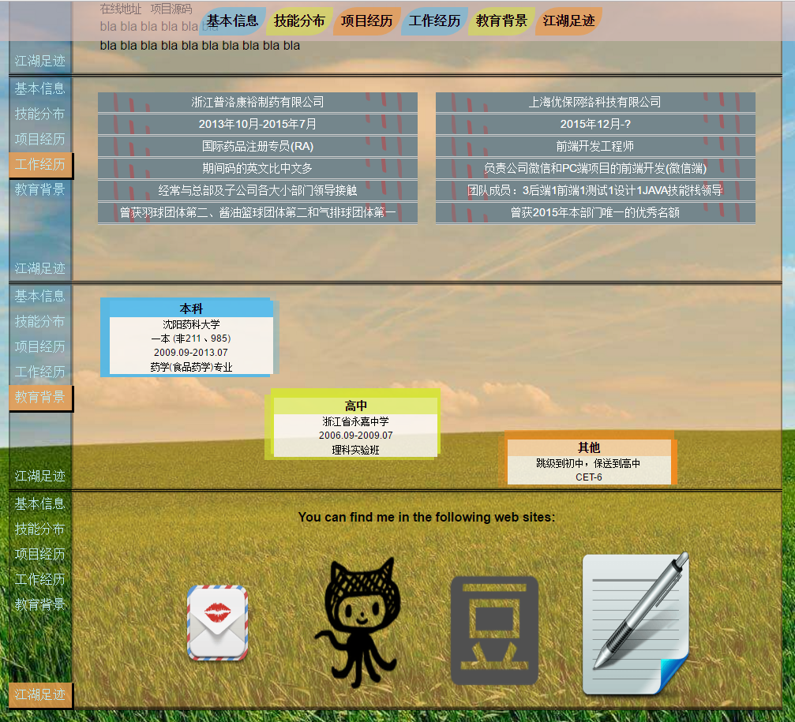

# CV of Yakima Teng

## Introduction

This is a repository for me to generate my CV. If you like it, you can fork it and revise the content to be what is appropriate to you, to generate your desired online CV ^_^. I use grunt to establish the development environment. But grunt is a little slow in reaction speed. So please keep patient when using this development environment. Because this is the only project I use grunt and I need a demo for grunt usage, I would probably not replace grunt with gulp or other substitute goods. However, I really recommended you to re-establish the development environment if you will use this project code for quite a while. 

## Screenshots

What this CV looks like in PC:


What this CV looks like in mobile device:



Established by Yakima Teng

## Installation

If you are trying to start this project in China mainland, and in case that you do not plan to use VPN tools, it's strongly recommended that you use the taobao npm mirror registry (https://registry.npm.taobao.org) instead of the default one (https://registry.npmjs.org). All this has already been done, so you don't have to do anything.

To change the mirror registry address (in case you prefer other mirror registry than the taobao mirror registry), you should do the followings:

1. open file `package-lock.json`, and replace all `https://registry.npm.taobao.org` with your target mirror registry address;

2. open file `.npmrc`, and replace `https://registry.npm.taobao.org` with your target mirror registry address.

And that's all.

## Development

Please be informed that, before you start to develop, there is an optional step you can do if you want to deploy your work to an SFTP-available server more easily: you can copy and rename the `config-example.json` file to be `config.json`, and change the content to suit yours. This is an optional step, which means that it won't influence the actual development process.

Type the following command to start the development process, it will open a webpage in your browser and refresh the page automatically when changes to your development files are detected.

```bash
npm run dev
```

## Deploy to server through sftp

Script like 'npm run deploy' defined in the package.json file won't be available at your first use. You need to copy and rename `config-example.json` to `config.json` and revise the content to  to make it available. One small tip here:
Before you make any changes under the key "scp", you can first cd to your project root and then use the command below to avoid committing and pushing your local private information to the remote repository accidentally:
```bash
git update-index --assume-unchanged gruntfile.js
```
Later, in case that you want again to restore the trace of file you ignored before, just cd to your project root and type command like below:
```bash
git update-index --no-assume-unchanged gruntfile.js
```

## Deploy to remote repositories providing Pages function

I employed a npm package named "gh-pages", please visit its official websites for details. For usage examples, you can also refer to the following commands defined in package.json file:

```bash
"scripts": {
    ...
    "deployToGithub": "gh-pages -d dist/cv",
    "deployToOSChina": "gh-pages -d dist/cv -b oschina-pages -o oschina -r https://git.oschina.net/yakima/cv.git",
    ...
},
```

## Notes

1. Tools: Grunt, VueJS1+ (actually, I am in favor of gulp and webpack other then grunt, it seems to be too slow in action speed -_-. I used it here because I havn't had any experience of its usage before.)
2. Online demo: [http://www.orzzone.com/projects/cv/](http://www.orzzone.com/projects/cv/)

## License

The MIT License (MIT)
